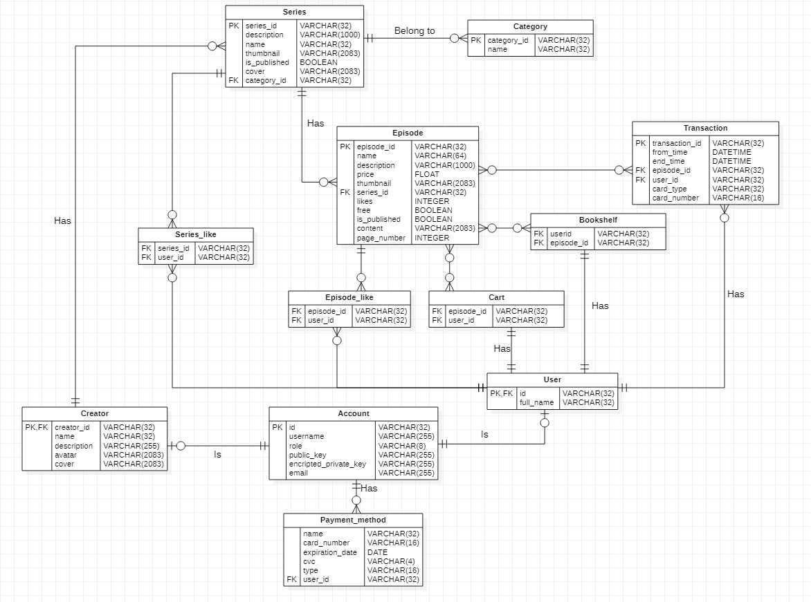

<p align="center">
  <a href="https://github.com/thuan2172001/nodejs-postgres-backend">
    
  </a>

  <h3 align="center">WebtoonZ</h3>

  <p align="center">
    Shop to buy and sell exclusive digital works of an author!
    <br />
    <a href="https://glucozo.herokuapp.com/">View Demo</a>
    ·
    <a href="https://github.com/thuan2172001/nodejs-postgres-backend/issues">Report Bug</a>
    ·
    <a href="https://github.com/thuan2172001/nodejs-postgres-backend/issues">Request Feature</a>
  </p>
</p>

## About The Project
 An author's online store, selling exclusive digital works. Support reading and paying directly on the system.c phẩm.
### Built With

Frameworks and technology using to build this project:
* [Nodejs](https://nodejs.dev/)
* [Express](https://expressjs.com/)
* [Postgresql](https://www.postgresql.org/)
* [Docker](https://docker.com)
## Getting Started
To get a local copy up and running follow these simple example steps.
### Prerequisites

You need to install docker and docker-compose to run this project.
* Install docker (https://docs.docker.com/engine/install)
* Install docker-compose (https://docs.docker.com/compose/install)
### Installation

1. Clone the repo
   ```sh
   git clone https://github.com/thuan2172001/nodejs-postgres-backend
   ```
2. Create file .env in folder deploy/dev to set up environment variables
   ```yml
   - PROJECT_NAME=WebtoonZ
   - SERVER_PORT=4200 
   - PG_URL=postgres
   - PG_USER=root
   - PG_PASS=root
   - PG_DB=db
   - API_PREFIX=/api
   - PG_PORT=5432
   - CHECK_AUTH=true
   - CHECK_CHANGE_PASSWORD=true 
   - CHECK_REQUEST_SIGNATURE=true
   - UPLOAD_PATH=uploads/
   - SEED_DATA=true
   - VERSION=1.0
   - MEMORY_LIMIT=1000M 
   - MEMORY_RESERVATIONS=256M 
   - UPLOAD_DIR=uplosfd/
   - URL=http://localhost:4200
   - FRONTEND_BASE_URL=https://glucozo.herokuapp.com
   - MAIL_NAME={YOUR_MAIL}
   - MAIL_PASS={YOUR_MAIL_PASSWORD}
   - STRIPE_TOKEN={YOUR_STRIPE_TOKEN}
   - STRIPE_API_KEY={YOUR_STRIPE_API_KEY}
   - STRIPE_PUBLIC_KEY={YOUR_STRIPE_PUBLIC_KEY}
   - AWS_BUCKET_NAME={YOUR_AWS_BUCKET_NAME}
   - AWS_ACCESS_KEY_ID={YOUR_AWS_ACCESS_KEY_ID}
   - AWS_SECRET_ACCESS_KEY={YOUR_AWS_SECRET_ACCESS_KEY}
   ```

3. Run script file to set up server by docker and run
- Only window
   ```sh
   ./convert-to-lf.sh
   ```
- First run to create database and set up server
   ```sh
   ./deploy/dev/recreate.sh
   ```
- Run server
   ```sh
   ./deploy/dev/restart.sh
   ```
- Stop server
   ```sh
   ./deploy/dev/stop.sh
   ```
### Database
- Postgresql is used in this project
- ERM 
